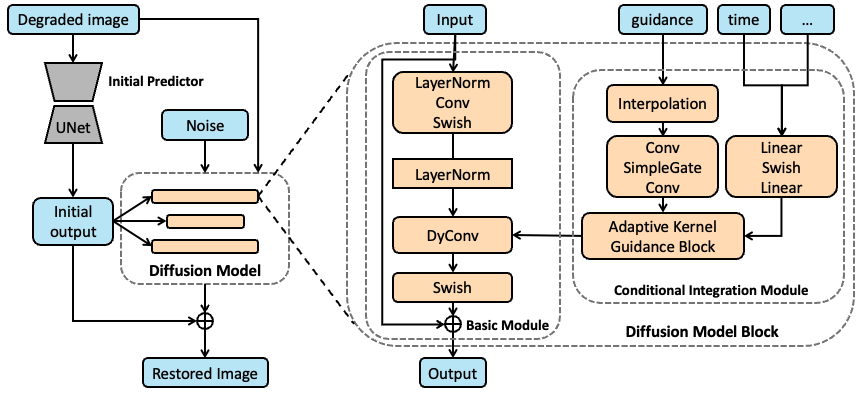
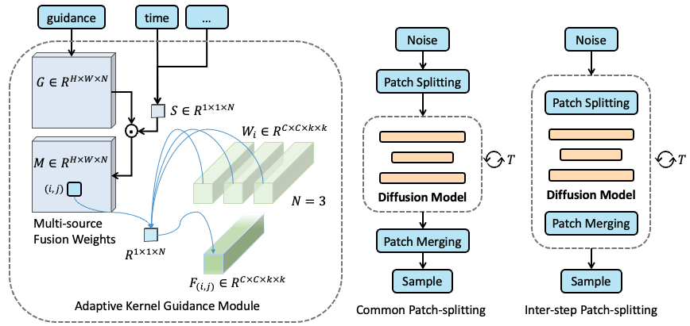

# A Unified Conditional Framework for Diffusion-based Image Restoration

[Yi Zhang](https://zhangyi-3.github.io/)<sup>1</sup>,
[Xiaoyu Shi](https://scholar.google.com/citations?user=fbEuTJUAAAAJ&hl=en)<sup>1</sup>, 
[Dasong Li](https://dasongli1.github.io/)<sup>1</sup>,
[Xiaogang Wang](https://scholar.google.com/citations?user=-B5JgjsAAAAJ)<sup>1</sup>, 
[Jian Wang](https://jianwang-cmu.github.io/)<sup>2</sup>, 
[Hongsheng Li](https://www.ee.cuhk.edu.hk/~hsli/)<sup>1</sup><br>
<sup>1</sup>The Chinese University of Hong Kong, <sup>2</sup>Snap Research

[Project](https://zhangyi-3.github.io/project/UCDIR)

[](https://arxiv.org/abs/2305.20049)

<hr />

> **Abstract:** *Diffusion Probabilistic Models (DPMs) have recently shown remarkable performance 
> in image generation tasks, which are capable of generating highly realistic images. When adopting 
> DPMs for image restoration tasks, the crucial aspect lies in how to integrate the conditional 
> information to guide the DPMs to generate accurate and natural output, which has been largely 
> overlooked in existing works.
In this paper, we present a unified conditional framework based on diffusion models for image 
> restoration. We leverage a lightweight UNet to predict initial guidance and the diffusion model to 
> learn the residual of the guidance. By carefully designing the basic module and integration module 
> for the diffusion model block, we integrate the guidance and other auxiliary conditional information
> into every block of the diffusion model to achieve spatially-adaptive generation conditioning.
> To handle high-resolution images, we propose a simple yet effective inter-step patch-splitting 
> strategy to produce arbitrary-resolution images without grid artifacts. We evaluate our conditional
> framework on three challenging tasks: extreme low-light denoising, deblurring, and JPEG restoration,
> demonstrating its significant improvements in perceptual quality and the generalization to 
> restoration tasks.* 
<hr />

## Network Architecture

 

 

## Training

[//]: # (Run `python setup.py develop --no_cuda_ext` to install basicsr.)
```
 Coming soon.

```


## Evaluation
```
 Coming soon.

```

 
## Citation
If you use KBNet, please consider citing:

    @article{zhang2023UCDIR,
      author    = {Zhang, Yi and Shi, Xiaoyu and Li, Dasong and Wang, Xiaogang and Wang, Jian and Li, Hongsheng},
      title     = {A Unified Conditional Framework for Diffusion-based Image Restoration},
      journal   = {arXiv preprint arXiv:2305.20049},
      year      = {2023},
    }

## Contact
Should you have any question, please contact zhangyi@link.cuhk.edu.hk


**Acknowledgment:** [BasicSR](https://github.com/xinntao/BasicSR), [S3](https://github.com/Janspiry/Image-Super-Resolution-via-Iterative-Refinement). 
 